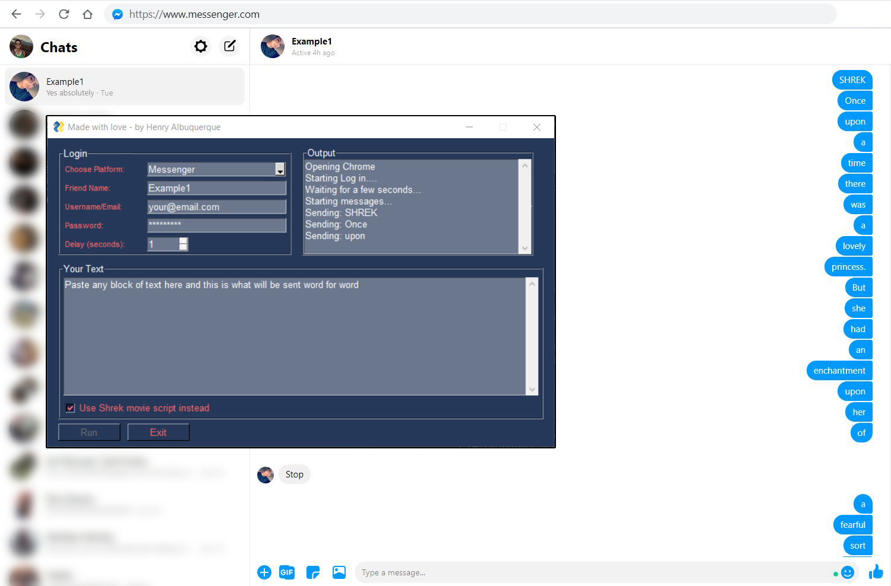

<p align="center">

  

  <h1 align="center">Social media message spammer </h1>

  <p align="center">Facebook | Discord | WhatsApp


  </p>

</p>

<p align="center">

  

</p> 

## Installation  

  

Clone or download this repo:

`` git clone https://github.com/HenryAlbu/FB-Messenger-Whatsapp-Discord-message-spammer.git``

Go to the project directory

`` cd FB-Messenger-Whatsapp-Discord-message-spammer``

Install the requirements:

``pip install -r requirements.txt``  

Install ChromeDriver ([doc](https://github.com/SeleniumHQ/selenium/wiki/ChromeDriver)): 

```pip install chromedriver```

This project is Selenium based and requires a `chromedriver` browser. I have already included one in the project files for Chrome 81/Windows. If you want to get a newer version or for a different OS, [download it here](https://sites.google.com/a/chromium.org/chromedriver/downloads) and drag and drop it into the directory.

## Running

Just run: 

``python app.py``

The input field "Friend Name" is the name of the user as it appears on each platform. In the example below, the friend name would be "Example1"

<p align="left">

  

</p> 

## UI 

<p align="center">

  

</p>  

  

## Caution 

 

Be careful when setting the "delay" between messages. It's best to keep it at 1 second to avoid getting flagged as spam

